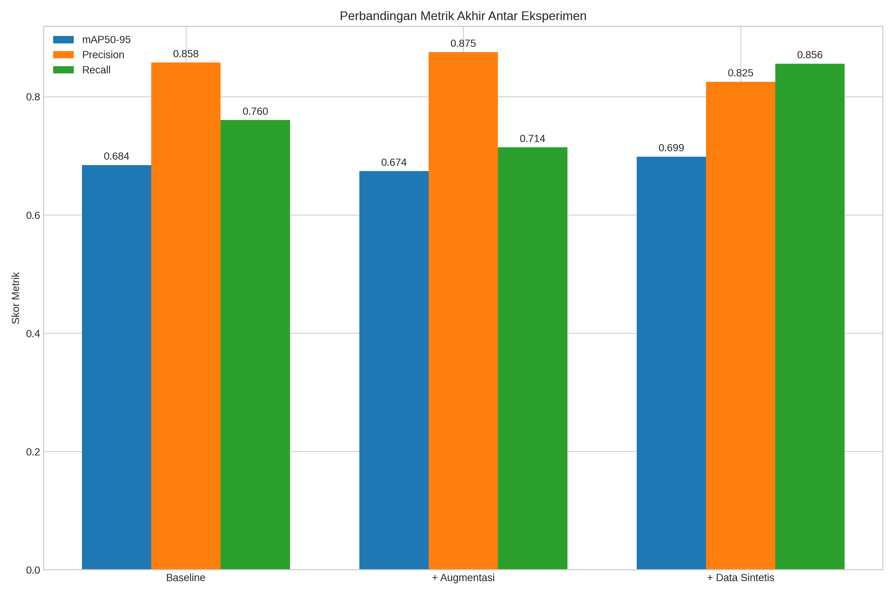

# Deteksi Objek Produk Ritel dengan YOLOv8 dan Data Sintetis

Repositori ini berisi kode dan hasil dari penelitian yang membandingkan tiga strategi data-centric (Baseline, Augmentasi, Data Sintetis) untuk melatih model deteksi objek YOLOv8 pada dataset produk ritel yang terbatas.



## 📌 Latar Belakang

Penelitian ini bertujuan untuk mengatasi tantangan kelangkaan data pelatihan di industri ritel. Kami mengevaluasi apakah augmentasi data atau penambahan data sintetis merupakan strategi yang lebih efektif untuk meningkatkan performa model ketika dataset asli hanya terdiri dari 152 gambar.

## 🛠️ Instalasi & Setup

1.  **Clone repositori ini:**
    ```bash
    git clone https://github.com/billyaf/yolov8-retail-synthetic-data.git
    cd yolov8-retail-synthetic-data
    ```

2.  **Buat environment virtual (disarankan):**
    ```bash
    python -m venv venv
    source venv/bin/activate  # Di Windows: venv\Scripts\activate
    ```

3.  **Instal library yang dibutuhkan:**
    ```bash
    pip install -r requirements.txt
    ```

4.  **Unduh Dataset:**
    Dataset tidak termasuk dalam repositori ini. Anda perlu mengunduh dua versi dataset dari tautan di bawah dan menempatkannya di dalam folder `data/`.

    * **Dataset Asli (152 Gambar):**
        * **Unduh dari:** **https://drive.google.com/drive/folders/1bZkthuTlkf1KDQUz1JOVOuHXPi5otXiU?usp=sharing**
        * **Tujuan:** Ekstrak dan letakkan isinya sehingga strukturnya menjadi `data/original_dataset/`.

    * **Dataset Sintetis (1000+ Gambar):**
        * **Unduh dari:** **https://drive.google.com/drive/folders/11pdnc4i5arH3aFeWxr074A-OU9lKhqge?usp=sharing**
        * **Tujuan:** Ekstrak dan letakkan isinya sehingga strukturnya menjadi `data/synthetic_dataset/`.

## 🚀 Cara Menjalankan

Seluruh proses eksperimen, mulai dari analisis data hingga pelatihan dan evaluasi model, terdapat di dalam notebook Jupyter berikut:

* [`notebooks/yolov8_retail_experiment.ipynb`](notebooks/yolov8_retail_experiment.ipynb)

Buka notebook ini dan jalankan sel-selnya secara berurutan. Pastikan path dataset di dalam notebook sudah benar.

## 📈 Hasil

Hasil utama menunjukkan bahwa suplementasi **data sintetis** memberikan peningkatan performa yang paling signifikan, meningkatkan mAP50-95 dari 68.1% (baseline) menjadi **68.9%**.

